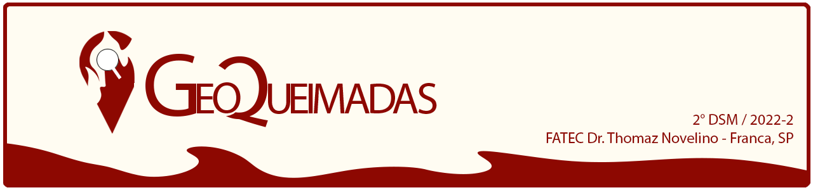
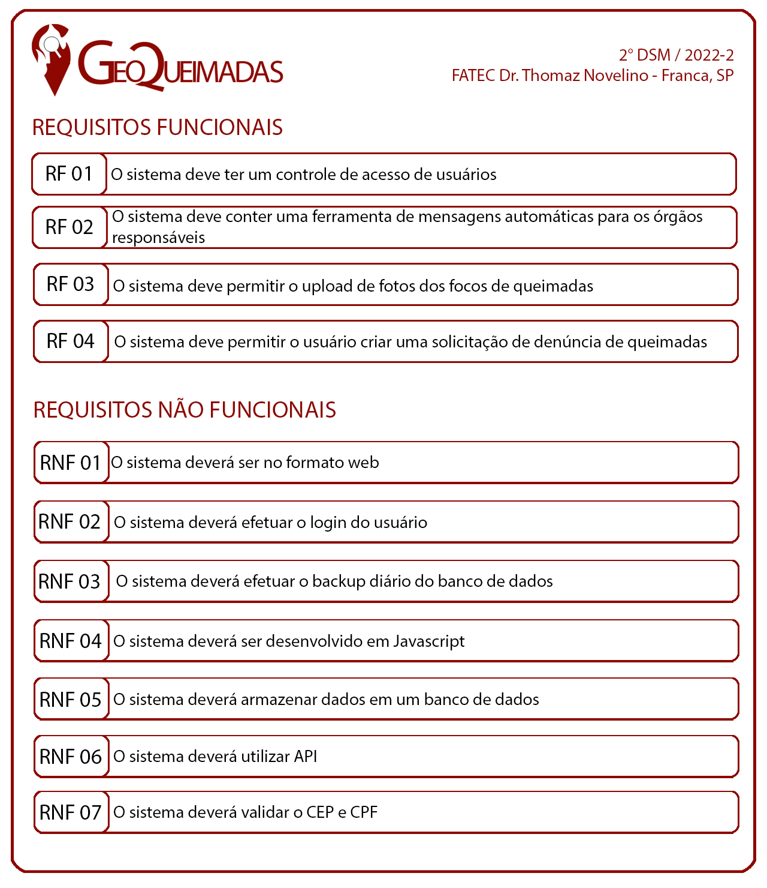

 

 

    <a href="#sobre">Sobre</a>  |
    <a href="#backlog">Backlog</a>  |
    <a href="#userstorie">User Stories</a>  |
    <a href="#tecnologias">Tecnologias</a>  |  
    <a href="#equipe">Equipe</a>  |  
    <a href="#final">Apresentação Final</a>

## :bookmark_tabs: Sobre o projeto

A partir do desafio proposto do projeto interdisciplinar no 2º semestre do curso Desenvolvimento de Software Multiplataforma da Fatec Franca de construir um site, com o intuito de solucionar um problema de algum tema dos 17 objetivos de desenvolvimento sustentável da ONU, nosso grupo desenvolveu um site voltado para um sistema de controle de queimadas, onde o usuário poderá enviar no site locais que estão tendo queimadas em tal momento, e o sistema irá redirecionar tais endereços para os órgãos responsáveis ao combate de queimadas.

:pushpin: Status do Projeto: 🚧: **Em andamento** 🚧

## Backlog

 

    

## 🛠️ Tecnologias 🛠️ 

As seguintes ferramentas, linguagens, bibliotecas e tecnologias foram usadas na construção do projeto:
    

## :busts_in_silhouette: Equipe
    
| Nome                    | LinkedIn & GitHub |
| :-----------------------| :---------------------------------------------------------------------------------------------------------------------------------------------------------------------------------------------------------------------------------------------------------------------------: | 
| Gabriel Vinicius Pagnan    |   |    
| Leonardo Alves Costa    |   |    
| Rafael Cesar Ferreira   |   |    
| Rafael Malaquias Chioca |   |

## :clapper: Apresentação Final do Projeto :clapper:
    
🚧: **Em andamento** 🚧
    

→ [Voltar ao topo](#topo)
